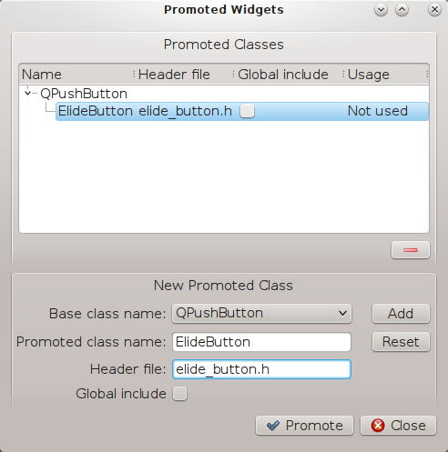

# Promoted Widgets
如果你有一些自定义的widgets,但是又希望用designer来画ui，这时有两种做法：

- 把这些widgets做成插件，让他们出现在designer左侧的widget列表里。但这样难度比较高，如果不是需要经常反复使用的widget，没必要这么做
- 使用promoted widgets，操作相对简单

以[3.1带overflow效果的按钮](../widget/css_overflowlabel.md)为例：


如果你定义了ElideButton这个Subclass，你可以把他保存成单独一个文件elide_button.py，然后在designer里依然用QPushButton，但是创建之后在上面右击，选择Promote to,然后照下图填入



其中ElideButton必须和你的subclass的名字一致，elide_button.h必须和你的.py文件名一致(请无视.h)

这样你就可以达到，虽然designer里画的是QPushButton,但是当运行的时候，他其实使用的是你的ElideButton。

代码如下：
```python
#!/usr/bin/env python2
import os
import sys
from PyQt4 import QtGui, QtCore
from PyQt4.QtCore import Qt, QString
from PyQt4 import uic


class TheUI(QtGui.QDialog):

    def __init__(self, args=None, parent=None):
        super(TheUI, self).__init__(parent)
        self.ui = uic.loadUi('elide_button.ui', self)
        self.pushButton.setText('Oh Yeah This is a super long string')
        self.ui.show()
        self.setMinimumWidth(20)

if __name__ == '__main__':
    app = QtGui.QApplication(sys.argv)
    gui = TheUI()
    gui.show()
    app.exec_()
```
综上，你可以随意使用自己定义的widget,与此同时还可以使用designer来画ui，只要你在designer里把相应的widget promote成你自定义的widget即可。
