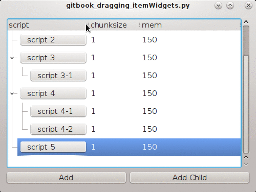

# 拖拽带itemWidget的treeWidgetItem

如果你在QTreeWidget的item上了itemWidget，你会发现拖放之后,itemWidget就消失了，这是“正常现象“，因为按照qt文档的[描述](http://qt-project.org/doc/qt-4.8/qtreewidget.html#setItemWidget)，这个`setItemWidget`只能用来显示静态widet。

这里想了一个绕过的方法：给每个custom widget都写一个`clone` method,使其 返回一个和自己当前状态完全一样的新的instance，然后在TreeWidget的dropEvent里调用这个`clone` method，drop之前把"clone"出来的emWidget存在list里，drop之后再setItemWidget回去。





下面的代码包含了前一节的[自定义drop indicator](drop_indicator.md)的效果

```python
#!/usr/bin/env python2
import os
import sys
import re

from PyQt4 import QtGui, QtCore
from PyQt4.QtCore import Qt, QString


class MyWidget(QtGui.QDialog):

    def __init__(self, parent=None, val=None):
        super(MyWidget, self).__init__()
        self.layout = QtGui.QHBoxLayout(self)
        browseBtn = ElideButton(parent)
        browseBtn.setMinimumSize(QtCore.QSize(0, 25))
        browseBtn.setText(QString(val))
        browseBtn.setStyleSheet("text-align: left")
        self.layout.addWidget(browseBtn)
        self.browseBtn = browseBtn
        self.browseBtn.clicked.connect(self.browseCommandScript)
        self.browseBtn.setIconSize(QtCore.QSize(64, 64))

    def browseCommandScript(self):
        script = QtGui.QFileDialog.getOpenFileName(
            self, 'Select Script file', '/tmp/crap', "Executable Files (*)")
        if script:
            self._script = script
            old_text = str(self.browseBtn.text()).strip()
            old_text = re.search('^script [\d-]*', old_text).group()
            self.browseBtn.setText(('%s %s' % (old_text, script)))

    def clone(self):
        clone = MyWidget(val=str(self.browseBtn.text()))
        return clone


class ElideButton(QtGui.QPushButton):

    def __init__(self, parent=None):

        super(ElideButton, self).__init__(parent)
        font = self.font()
        font.setPointSize(10)
        self.setFont(font)

    def paintEvent(self, event):
        painter = QtGui.QStylePainter(self)

        metrics = QtGui.QFontMetrics(self.font())
        elided = metrics.elidedText(self.text(), Qt.ElideRight, self.width())

        option = QtGui.QStyleOptionButton()
        self.initStyleOption(option)
        option.text = ''
        painter.drawControl(QtGui.QStyle.CE_PushButton, option)
        painter.drawText(self.rect(), Qt.AlignLeft | Qt.AlignVCenter, elided)


class MyTreeView(QtGui.QTreeView):

    def __init__(self, parent=None):
        super(MyTreeView, self).__init__(parent)
        self.dropIndicatorRect = QtCore.QRect()

    def paintEvent(self, event):
        painter = QtGui.QPainter(self.viewport())
        self.drawTree(painter, event.region())
        # in original implementation, it calls an inline function paintDropIndicator here
        self.paintDropIndicator(painter)

    def paintDropIndicator(self, painter):

        if self.state() == QtGui.QAbstractItemView.DraggingState:
            opt = QtGui.QStyleOption()
            opt.init(self)
            opt.rect = self.dropIndicatorRect
            rect = opt.rect

            if rect.height() == 0:
                pen = QtGui.QPen(QtCore.Qt.black, 1, QtCore.Qt.DashLine)
                painter.setPen(pen)
                painter.drawLine(rect.topLeft(), rect.topRight())
            else:
                pen = QtGui.QPen(QtCore.Qt.black, 1, QtCore.Qt.DashLine)
                painter.setPen(pen)
                painter.drawRect(rect)


class MyTreeWidget(QtGui.QTreeWidget, MyTreeView):

    # def mouseMoveEvent(self, e):
    #     if self.state()==QtGui.QAbstractItemView.DraggingState:
    #         mimeData = self.model().mimeData(self.selectedIndexes())
    #         drag = QtGui.QDrag(self)
    #         drag.setMimeData(mimeData)
    #         drag.exec_(QtCore.Qt.MoveAction)

    def startDrag(self, supportedActions):
        listsQModelIndex = self.selectedIndexes()
        if listsQModelIndex:
            mimeData = QtCore.QMimeData()
            dataQMimeData = self.model().mimeData(listsQModelIndex)
            # if not dataQMimeData:
            #     return None
            dragQDrag = QtGui.QDrag(self)
            # dragQDrag.setPixmap(QtGui.QPixmap('test.jpg')) # <- For put your custom image here
            dragQDrag.setMimeData(dataQMimeData)
            defaultDropAction = QtCore.Qt.IgnoreAction
            if ((supportedActions & QtCore.Qt.CopyAction) and (self.dragDropMode() != QtGui.QAbstractItemView.InternalMove)):
                defaultDropAction = QtCore.Qt.CopyAction
            dragQDrag.exec_(supportedActions, defaultDropAction)

    def dragMoveEvent(self, event):
        pos = event.pos()
        item = self.itemAt(pos)

        if item:
            index = self.indexFromItem(item)

            rect = self.visualRect(index)
            rect_left = self.visualRect(index.sibling(index.row(), 0))
            rect_right = self.visualRect(index.sibling(index.row(), self.columnCount() - 1))
            self.dropIndicatorPosition = self.position(event.pos(), rect, index)

            if self.dropIndicatorPosition == self.AboveItem:
                self.dropIndicatorRect = QtCore.QRect(rect_left.left(), rect_left.top(), rect_right.right() - rect_left.left(), 0)
                event.accept()
            elif self.dropIndicatorPosition == self.BelowItem:
                self.dropIndicatorRect = QtCore.QRect(rect_left.left(), rect_left.bottom(), rect_right.right() - rect_left.left(), 0)
                event.accept()

            elif self.dropIndicatorPosition == self.OnItem:
                self.dropIndicatorRect = QtCore.QRect(rect_left.left(), rect_left.top(), rect_right.right() - rect_left.left(), rect.height())
                event.accept()
            else:
                self.dropIndicatorRect = QtCore.QRect()

            self.model().setData(index, self.dropIndicatorPosition, Qt.UserRole)

            # self.setState(QtGui.QAbstractItemView.DraggingState)
        # This is necessary or else the previously drawn rect won't be erased
        self.viewport().update()

    def iterativeChildren(self, nodes):
        results = []
        while True:
            newNodes = []
            if not nodes:
                break
            for node in nodes:
                results.append(node)
                for i in range(node.childCount()):
                    print 'newNodes:', newNodes
                    newNodes += [node.child(i)]
            nodes = newNodes
        results = nodes + results
        return results

    def keyPressEvent(self, event):
        'delete currently selected item'
        QtGui.QTreeWidget.keyPressEvent(self, event)
        key = event.key()

        if self.currentItem():

            root = self.invisibleRootItem()
            parent = self.currentItem().parent() or root

            if key == Qt.Key_Delete:
                parent.removeChild(self.currentItem())

    def dropEvent(self, event):
        pos = event.pos()
        item = self.itemAt(pos)
        if item:
            index = self.indexFromItem(item)
            self.model().setData(index, 0, Qt.UserRole)

        if item is self.currentItem():
            QtGui.QTreeWidget.dropEvent(self, event)
            event.accept()
            return

        if event.source == self and event.dropAction() == Qt.MoveAction or self.dragDropMode() == QtGui.QAbstractItemView.InternalMove:

            topIndex = QtCore.QModelIndex()
            col = -1
            row = -1

            l = [event, row, col, topIndex]

            if self.dropOn(l):

                event, row, col, topIndex = l

                idxs = self.selectedIndexes()
                indexes = []
                existing_rows = set()
                for i in idxs:
                    if i.row() not in existing_rows:
                        indexes.append(i)
                        existing_rows.add(i.row())

                if topIndex in indexes:
                    return

                # try storing the itemWidgets first
                # we should iterate through all child items,and store itemWidgets for them
                widgets = []

                dropRow = self.model().index(row, col, topIndex)
                taken = []

                indexes_reverse = indexes[:]
                indexes_reverse.reverse()
                # i = 0
                for index in indexes_reverse:
                    parent = self.itemFromIndex(index)
                    item_widget = self.itemWidget(parent, 0)

                    print 'item_widget:', item_widget, item_widget.parent()

                    # item_widget.setParent(self)
                    print 'dragging item has child:', parent.childCount()

                    # print 'before dragging, child 0 ',self.itemWidget( parent.child(0),0).browseBtn.text()

                    # in case it has children , we get all of them
                    all_child = []

                    all_items = self.iterativeChildren([parent])

                    print 'all items:', len(all_items), all_items

                    # store cloned widgets in a list
                    widgets = [self.itemWidget(i, 0).clone() for i in all_items]

                    # widgets.append(item_widget.clone())

                    if not parent or not parent.parent():
                        # if not parent or not isinstance(parent.parent(),QtGui.QTreeWidgetItem):
                        taken.append(self.takeTopLevelItem(index.row()))
                    else:
                        taken.append(parent.parent().takeChild(index.row()))

                    # i += 1
                    # break

                taken.reverse()

                print 'itemWidgets:', widgets

                for index in indexes:
                    print 'inserting: topIndex:', topIndex.isValid(), row
                    if row == -1:  # means index=root
                        if topIndex.isValid():  # Returns the model index of the model's root item. The root item is the parent item to the view's toplevel items. The root can be invalid.
                            parent = self.itemFromIndex(topIndex)
                            parent.insertChild(parent.childCount(), taken[0])

                            # after insert the itemwidget is gone
                            # print 'after dragging, child 0 ',self.itemWidget( taken[0],0).browseBtn.text()

                            # self.setItemWidget(taken[0],0,QtGui.QLineEdit())
                            # self.setItemWidget(taken[0],0,new_widget)
                            print 'row==-1,if',  # self.itemWidget(taken[0],0),self.itemWidget(taken[0],0).parent()
                            # taken = taken[1:]

                        else:
                            self.insertTopLevelItem(self.topLevelItemCount(), taken[0])
                            # taken = taken[1:]
                            print 'row==-1,else'
                    else:
                        r = dropRow.row() if dropRow.row() >= 0 else row
                        if topIndex.isValid():
                            parent = self.itemFromIndex(topIndex)
                            parent.insertChild(min(r, parent.childCount()), taken[0])
                            # taken = taken[1:]
                            print 'row!=-1,if'
                        else:
                            self.insertTopLevelItem(min(r, self.topLevelItemCount()), taken[0])
                            # taken = taken[1:]
                            print 'row!=-1,else'

                    all_items = self.iterativeChildren([taken[0]])

                    for i, w in zip(all_items, widgets):
                        self.setItemWidget(i, 0, w)

                    taken = taken[1:]
                event.accept()

        QtGui.QTreeWidget.dropEvent(self, event)
        self.expandAll()
        self.updateGeometry()

    def position(self, pos, rect, index):
        r = QtGui.QAbstractItemView.OnViewport
        # margin*2 must be smaller than row height, or the drop onItem rect won't show
        margin = 10
        if pos.y() - rect.top() < margin:
            r = QtGui.QAbstractItemView.AboveItem
        elif rect.bottom() - pos.y() < margin:
            r = QtGui.QAbstractItemView.BelowItem
        # elif rect.contains(pos, True):
        elif pos.y() - rect.top() > margin and rect.bottom() - pos.y() > margin:
            r = QtGui.QAbstractItemView.OnItem

        return r

    def dropOn(self, l):

        event, row, col, index = l

        root = self.rootIndex()

        if self.viewport().rect().contains(event.pos()):
            index = self.indexAt(event.pos())
            # if drop on nothing or drop out side of index zone
            print 'in drop on ', index, index.isValid(), self.visualRect(index).contains(event.pos())
            if not index.isValid() or not self.visualRect(index).contains(event.pos()):
                index = root

        if index != root:

            dropIndicatorPosition = self.position(event.pos(), self.visualRect(index), index)
            if self.dropIndicatorPosition == self.AboveItem:
                print 'dropon above'
                row = index.row()
                col = index.column()
                index = index.parent()

            elif self.dropIndicatorPosition == self.BelowItem:
                print 'dropon below'
                row = index.row() + 1
                col = index.column()
                index = index.parent()

            elif self.dropIndicatorPosition == self.OnItem:
                print 'dropon onItem'
                pass
            elif self.dropIndicatorPosition == self.OnViewport:
                pass
            else:
                pass

        else:
            self.dropIndicatorPosition = self.OnViewport

        l[0], l[1], l[2], l[3] = event, row, col, index

        # if not self.droppingOnItself(event, index):
        return True


class TheUI(QtGui.QDialog):

    def __init__(self, args=None, parent=None):
        super(TheUI, self).__init__(parent)
        self.layout1 = QtGui.QVBoxLayout(self)
        treeWidget = MyTreeWidget()

        # treeWidget.setSelectionMode(QtGui.QAbstractItemView.ExtendedSelection)
        # treeWidget.setSelectionRectVisible(True)

        button1 = QtGui.QPushButton('Add')
        button2 = QtGui.QPushButton('Add Child')

        self.layout1.addWidget(treeWidget)

        self.layout2 = QtGui.QHBoxLayout()
        self.layout2.addWidget(button1)
        self.layout2.addWidget(button2)

        self.layout1.addLayout(self.layout2)

        treeWidget.setHeaderHidden(True)

        self.treeWidget = treeWidget
        self.button1 = button1
        self.button2 = button2
        self.button1.clicked.connect(lambda *x: self.addCmd())
        self.button2.clicked.connect(lambda *x: self.addChildCmd())

        HEADERS = ("script", "chunksize", "mem")
        self.treeWidget.setHeaderLabels(HEADERS)
        self.treeWidget.setColumnCount(len(HEADERS))

        self.treeWidget.setColumnWidth(0, 160)
        self.treeWidget.header().show()

        self.treeWidget.setDragDropMode(QtGui.QAbstractItemView.InternalMove)
        self.treeWidget.setStyleSheet('''
                                         QTreeView {
                                             show-decoration-selected: 1;
                                         }

                                         QTreeView::item:hover {
                                             background: qlineargradient(x1: 0, y1: 0, x2: 0, y2: 1, stop: 0 #e7effd, stop: 1 #cbdaf1);
                                         }

                                         QTreeView::item:selected:active{
                                             background: qlineargradient(x1: 0, y1: 0, x2: 0, y2: 1, stop: 0 #6ea1f1, stop: 1 #567dbc);
                                         }

                                         QTreeView::item:selected:!active {
                                             background: qlineargradient(x1: 0, y1: 0, x2: 0, y2: 1, stop: 0 #6b9be8, stop: 1 #577fbf);
                                         }
                                         ''')

        self.resize(500, 350)
        for i in xrange(6):
            item = self.addCmd(i)
            if i in (3, 4):
                self.addChildCmd()
                if i == 4:
                    self.addCmd('%s-2' % i, parent=item)

        self.treeWidget.expandAll()
        self.setStyleSheet("QTreeWidget::item{ height: 30px;  }")

    def addChildCmd(self):
        parent = self.treeWidget.currentItem()
        self.addCmd(parent=parent)
        self.treeWidget.setCurrentItem(parent)

    def addCmd(self, i=None, parent=None):
        'add a level to tree widget'

        root = self.treeWidget.invisibleRootItem()
        if not parent:
            parent = root

        if i is None:
            if parent == root:
                i = self.treeWidget.topLevelItemCount()
            else:
                i = str(parent.text(0)).strip()[7:]
                i = '%s-%s' % (i, parent.childCount() + 1)

        # item = QtGui.QTreeWidgetItem(parent, ['script %s' % i, '1', '150'])

        script = '   script %s' % i
        item = QtGui.QTreeWidgetItem(parent, [script, '1', '150'])

        self.treeWidget.setItemWidget(item, 0, MyWidget(val=script))

        self.treeWidget.setCurrentItem(item)
        self.treeWidget.expandAll()
        return item

if __name__ == '__main__':
    app = QtGui.QApplication(sys.argv)
    gui = TheUI()
    gui.show()
    app.exec_()

```
