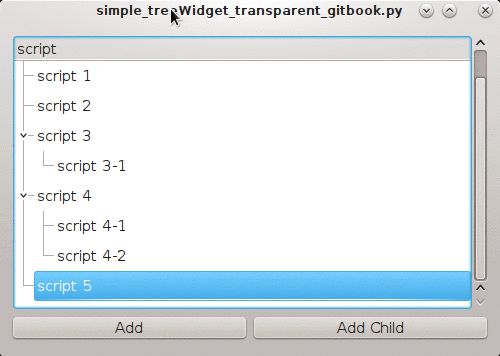

# 半透明效果拖拽

想实现的效果是使拖拽中的item半透明，如下图所示：



其中`renderToPixmap`function是根据qt源代码的相应部分(位于[qabstractitemview.cpp](https://qt.gitorious.org/qt/qt/source/9d9b7f53750dce2da88d7d11d312b4b36250b5c5:src/gui/itemviews/qabstractitemview.cpp#L3921)里)转换成python代码而来。


代码如下
```python
#!/usr/bin/env python2
import os
import sys
import re

from PyQt4 import QtGui, QtCore
from PyQt4.QtCore import Qt, QString


class MyTreeWidget(QtGui.QTreeWidget):

    def renderToPixmap(self, indexes, rect_list):

        rect = rect_list[0]

        rect = QtCore.QRect()
        rects = []
        for index in indexes:
            rects.append(self.visualRect(index))
            rect |= rects[-1]

        rect = rect.intersected(self.viewport().rect())
        if rect.width() <= 0 or rect.height() <= 0:
            return QPixmap()

        image = QtGui.QImage(rect.size(), QtGui.QImage.Format_ARGB32_Premultiplied)
        image.fill(0)
        painter = QtGui.QPainter(image)

        # not sure how to get a proper option
        # https://qt.gitorious.org/qt/qt/source/9d9b7f53750dce2da88d7d11d312b4b36250b5c5:src/gui/itemviews/qabstractitemview.cpp#L3930
        # option = QtGui.QStyleOptionViewItem()
        # here i assume that viewOptions are all the same for any row
        item = self.itemFromIndex(indexes[0])
        option = self.viewOptions()

        option.state |= QtGui.QStyle.State_Selected

        for i, index in enumerate(indexes):
            # option.rect = QtCore.QRect(rects[i].topLeft() - rect.topLeft()+QtCore.QPoint(10,20), rects[i].size())
            option.rect = QtCore.QRect(rects[i].topLeft() - rect.topLeft(), rects[i].size())
            self.itemDelegate().paint(painter, option, index)

        painter.end()
        return QtGui.QPixmap.fromImage(image)

    def startDrag(self, supportedActions):
        indexes = self.selectedIndexes()

        if len(indexes):
            data = self.model().mimeData(indexes)
            if not data:
                return

        rect = QtCore.QRect()
        pixmap = self.renderToPixmap(indexes, [rect])

        rect.adjust(self.horizontalOffset(), self.verticalOffset(), 0, 0)

        painter = QtGui.QPainter(pixmap)
        painter.setCompositionMode(painter.CompositionMode_DestinationIn)
        painter.fillRect(pixmap.rect(), QtGui.QColor(0, 0, 200, 127))
        painter.end()

        drag = QtGui.QDrag(self)
        drag.setMimeData(data)
        drag.setPixmap(pixmap)

        drag.exec_(QtCore.Qt.MoveAction)


class TheUI(QtGui.QDialog):

    def __init__(self, args=None, parent=None):
        super(TheUI, self).__init__(parent)
        self.layout1 = QtGui.QVBoxLayout(self)
        treeWidget = MyTreeWidget()

        treeWidget.setSelectionMode(QtGui.QAbstractItemView.ExtendedSelection)

        button1 = QtGui.QPushButton('Add')
        button2 = QtGui.QPushButton('Add Child')

        self.layout1.addWidget(treeWidget)

        self.layout2 = QtGui.QHBoxLayout()
        self.layout2.addWidget(button1)
        self.layout2.addWidget(button2)

        self.layout1.addLayout(self.layout2)

        treeWidget.setHeaderHidden(True)

        self.treeWidget = treeWidget
        self.button1 = button1
        self.button2 = button2
        self.button1.clicked.connect(lambda *x: self.addCmd())
        self.button2.clicked.connect(lambda *x: self.addChildCmd())

        HEADERS = ("script",)
        self.treeWidget.setHeaderLabels(HEADERS)
        self.treeWidget.setColumnCount(len(HEADERS))

        self.treeWidget.setColumnWidth(0, 160)
        self.treeWidget.header().show()

        self.treeWidget.setDragDropMode(QtGui.QAbstractItemView.InternalMove)

        self.resize(500, 340)
        for i in xrange(6):
            item = self.addCmd(i)
            if i in (3, 4):
                self.addChildCmd()
                if i == 4:
                    self.addCmd('%s-2' % i, parent=item)

        self.treeWidget.expandAll()
        self.setStyleSheet("QTreeWidget::item{ height: 30px;  }")

    def addChildCmd(self):
        parent = self.treeWidget.currentItem()
        self.addCmd(parent=parent)
        self.treeWidget.setCurrentItem(parent)

    def addCmd(self, i=None, parent=None):
        'add a level to tree widget'

        root = self.treeWidget.invisibleRootItem()
        if not parent:
            parent = root

        if i is None:
            if parent == root:
                i = self.treeWidget.topLevelItemCount()
            else:
                i = str(parent.text(0))[7:]
                i = '%s-%s' % (i, parent.childCount() + 1)

        item = QtGui.QTreeWidgetItem(parent, ['script %s' % i])

        self.treeWidget.setCurrentItem(item)
        self.treeWidget.expandAll()
        return item


if __name__ == '__main__':
    app = QtGui.QApplication(sys.argv)
    gui = TheUI()
    gui.show()
    app.exec_()
```

其中`pixmap = self.renderToPixmap(indexes, [rect])`里的`[rect]`是为了让`renderToPixmap`能够以by reference(传地址)的方式传递参数，因为list是mutable type。

此外，如果上面的代码在linux下运行，需要Compositing Manager的支持，理论上应该下面的代码要返回True才行：

```python
QtGui.QX11Info.isCompositingManagerRunning()
```
