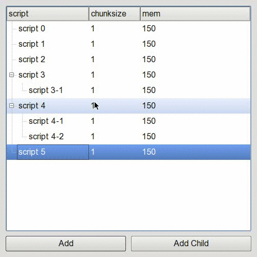

# 自定义drop indicator
想实现如下的效果:
- 加粗的drop indicator
- 修改插入的“判定”灵敏度(这一点很重要，因为默认判定是2px，很难轻松的把拖拽的item“插入”两行之间)



其中
- `MyTreeView`里的`paintDropIndicator`用来自定义paint drop indicator
- `position` function用来修改默认的插入“判定”，原始默认值是2,显然`margin*2`必须小于行高，不然“恰好”放在item上的判定就没法发生了
- 在`dragMoveEvent`里通过position返回的“判定”，来决定表示放手位置的dropIndicatorRect的坐标
- `dropEvent`就是把c++版直接翻译了下，应该需要继续改进，很多地方不是python里的恰当写法

代码如下
```python
#!/usr/bin/env python2

import os
import sys
import re

from PyQt4 import QtGui, QtCore
from PyQt4.QtCore import Qt, QString


class MyTreeView(QtGui.QTreeView):

    def __init__(self, parent=None):
        super(MyTreeView, self).__init__(parent)
        self.dropIndicatorRect = QtCore.QRect()

    def paintEvent(self, event):
        painter = QtGui.QPainter(self.viewport())
        self.drawTree(painter, event.region())
        # in original implementation, it calls an inline function paintDropIndicator here
        self.paintDropIndicator(painter)

    def paintDropIndicator(self, painter):

        if self.state() == QtGui.QAbstractItemView.DraggingState:
            opt = QtGui.QStyleOption()
            opt.init(self)
            opt.rect = self.dropIndicatorRect
            rect = opt.rect

            brush = QtGui.QBrush(QtGui.QColor(Qt.black))

            if rect.height() == 0:
                pen = QtGui.QPen(brush, 2, QtCore.Qt.SolidLine)
                painter.setPen(pen)
                painter.drawLine(rect.topLeft(), rect.topRight())
            else:
                pen = QtGui.QPen(brush, 2, QtCore.Qt.SolidLine)
                painter.setPen(pen)
                painter.drawRect(rect)


class MyTreeWidget(QtGui.QTreeWidget, MyTreeView):

    def startDrag(self, supportedActions):
        listsQModelIndex = self.selectedIndexes()
        if listsQModelIndex:
            mimeData = QtCore.QMimeData()
            dataQMimeData = self.model().mimeData(listsQModelIndex)
            dragQDrag = QtGui.QDrag(self)
            # dragQDrag.setPixmap(QtGui.QPixmap('test.jpg')) # <- For put your custom image here
            dragQDrag.setMimeData(dataQMimeData)
            defaultDropAction = QtCore.Qt.IgnoreAction
            if ((supportedActions & QtCore.Qt.CopyAction) and (self.dragDropMode() != QtGui.QAbstractItemView.InternalMove)):
                defaultDropAction = QtCore.Qt.CopyAction
            dragQDrag.exec_(supportedActions, defaultDropAction)

    def dragMoveEvent(self, event):
        pos = event.pos()
        item = self.itemAt(pos)

        if item:
            index = self.indexFromItem(item)  # this always get the default 0 column index

            rect = self.visualRect(index)
            rect_left = self.visualRect(index.sibling(index.row(), 0))
            rect_right = self.visualRect(index.sibling(index.row(), self.header().logicalIndex(self.columnCount() - 1)))  # in case section has been moved

            self.dropIndicatorPosition = self.position(event.pos(), rect, index)

            if self.dropIndicatorPosition == self.AboveItem:
                self.dropIndicatorRect = QtCore.QRect(rect_left.left(), rect_left.top(), rect_right.right() - rect_left.left(), 0)
                event.accept()
            elif self.dropIndicatorPosition == self.BelowItem:
                self.dropIndicatorRect = QtCore.QRect(rect_left.left(), rect_left.bottom(), rect_right.right() - rect_left.left(), 0)
                event.accept()
            elif self.dropIndicatorPosition == self.OnItem:
                self.dropIndicatorRect = QtCore.QRect(rect_left.left(), rect_left.top(), rect_right.right() - rect_left.left(), rect.height())
                event.accept()
            else:
                self.dropIndicatorRect = QtCore.QRect()

            self.model().setData(index, self.dropIndicatorPosition, Qt.UserRole)

        # This is necessary or else the previously drawn rect won't be erased
        self.viewport().update()

    def dropEvent(self, event):
        pos = event.pos()
        item = self.itemAt(pos)

        if item is self.currentItem():
            QtGui.QTreeWidget.dropEvent(self, event)
            event.accept()
            return

        if item:
            index = self.indexFromItem(item)
            self.model().setData(index, 0, Qt.UserRole)

        if event.source == self and event.dropAction() == Qt.MoveAction or self.dragDropMode() == QtGui.QAbstractItemView.InternalMove:

            topIndex = QtCore.QModelIndex()
            col = -1
            row = -1

            l = [event, row, col, topIndex]

            if self.dropOn(l):

                event, row, col, topIndex = l

                idxs = self.selectedIndexes()
                indexes = []
                existing_rows = set()
                for i in idxs:
                    if i.row() not in existing_rows:
                        indexes.append(i)
                        existing_rows.add(i.row())

                if topIndex in indexes:
                    return

                dropRow = self.model().index(row, col, topIndex)
                taken = []

                indexes_reverse = indexes[:]
                indexes_reverse.reverse()
                i = 0
                for index in indexes_reverse:
                    parent = self.itemFromIndex(index)
                    if not parent or not parent.parent():
                        # if not parent or not isinstance(parent.parent(),QtGui.QTreeWidgetItem):
                        taken.append(self.takeTopLevelItem(index.row()))
                    else:
                        taken.append(parent.parent().takeChild(index.row()))

                    i += 1
                    # break

                taken.reverse()

                for index in indexes:
                    if row == -1:
                        if topIndex.isValid():
                            parent = self.itemFromIndex(topIndex)
                            parent.insertChild(parent.childCount(), taken[0])
                            taken = taken[1:]

                        else:
                            self.insertTopLevelItem(self.topLevelItemCount(), taken[0])
                            taken = taken[1:]
                    else:
                        r = dropRow.row() if dropRow.row() >= 0 else row
                        if topIndex.isValid():
                            parent = self.itemFromIndex(topIndex)
                            parent.insertChild(min(r, parent.childCount()), taken[0])
                            taken = taken[1:]
                        else:
                            self.insertTopLevelItem(min(r, self.topLevelItemCount()), taken[0])
                            taken = taken[1:]

                event.accept()

        QtGui.QTreeWidget.dropEvent(self, event)
        self.expandAll()

    def position(self, pos, rect, index):
        r = QtGui.QAbstractItemView.OnViewport
        # margin*2 must be smaller than row height, or the drop onItem rect won't show
        margin = 10
        if pos.y() - rect.top() < margin:
            r = QtGui.QAbstractItemView.AboveItem
        elif rect.bottom() - pos.y() < margin:
            r = QtGui.QAbstractItemView.BelowItem

        # this rect is always the first column rect
        # elif rect.contains(pos, True):
        elif pos.y() - rect.top() > margin and rect.bottom() - pos.y() > margin:
            r = QtGui.QAbstractItemView.OnItem

        return r

    def dropOn(self, l):

        event, row, col, index = l

        root = self.rootIndex()

        if self.viewport().rect().contains(event.pos()):
            index = self.indexAt(event.pos())
            if not index.isValid() or not self.visualRect(index).contains(event.pos()):
                index = root

        if index != root:

            dropIndicatorPosition = self.position(event.pos(), self.visualRect(index), index)
            if self.dropIndicatorPosition == self.AboveItem:
                print 'dropon above'
                row = index.row()
                col = index.column()
                index = index.parent()

            elif self.dropIndicatorPosition == self.BelowItem:
                print 'dropon below'
                row = index.row() + 1
                col = index.column()
                index = index.parent()

            elif self.dropIndicatorPosition == self.OnItem:
                print 'dropon onItem'
                pass
            elif self.dropIndicatorPosition == self.OnViewport:
                pass
            else:
                pass

        else:
            self.dropIndicatorPosition = self.OnViewport

        l[0], l[1], l[2], l[3] = event, row, col, index

        # if not self.droppingOnItself(event, index):
        return True


class TheUI(QtGui.QDialog):

    def __init__(self, args=None, parent=None):
        super(TheUI, self).__init__(parent)
        self.layout1 = QtGui.QVBoxLayout(self)
        treeWidget = MyTreeWidget()

        treeWidget.setSelectionMode(QtGui.QAbstractItemView.ExtendedSelection)

        button1 = QtGui.QPushButton('Add')
        button2 = QtGui.QPushButton('Add Child')

        self.layout1.addWidget(treeWidget)

        self.layout2 = QtGui.QHBoxLayout()
        self.layout2.addWidget(button1)
        self.layout2.addWidget(button2)

        self.layout1.addLayout(self.layout2)

        treeWidget.setHeaderHidden(True)

        self.treeWidget = treeWidget
        self.button1 = button1
        self.button2 = button2
        self.button1.clicked.connect(lambda *x: self.addCmd())
        self.button2.clicked.connect(lambda *x: self.addChildCmd())

        HEADERS = ("script", "chunksize", "mem")
        self.treeWidget.setHeaderLabels(HEADERS)
        self.treeWidget.setColumnCount(len(HEADERS))

        self.treeWidget.setColumnWidth(0, 160)
        self.treeWidget.header().show()

        self.treeWidget.setDragDropMode(QtGui.QAbstractItemView.InternalMove)
        self.treeWidget.setStyleSheet('''
                                         QTreeView {
                                             show-decoration-selected: 1;
                                         }

                                         QTreeView::item:hover {
                                             background: qlineargradient(x1: 0, y1: 0, x2: 0, y2: 1, stop: 0 #e7effd, stop: 1 #cbdaf1);
                                         }

                                         QTreeView::item:selected:active{
                                             background: qlineargradient(x1: 0, y1: 0, x2: 0, y2: 1, stop: 0 #6ea1f1, stop: 1 #567dbc);
                                         }

                                         QTreeView::item:selected:!active {
                                             background: qlineargradient(x1: 0, y1: 0, x2: 0, y2: 1, stop: 0 #6b9be8, stop: 1 #577fbf);
                                         }
                                         ''')

        self.resize(500, 350)
        for i in xrange(6):
            item = self.addCmd(i)
            if i in (3, 4):
                self.addChildCmd()
                if i == 4:
                    self.addCmd('%s-2' % i, parent=item)

        self.treeWidget.expandAll()
        self.setStyleSheet("QTreeWidget::item{ height: 30px;  }")

    def addChildCmd(self):
        parent = self.treeWidget.currentItem()
        self.addCmd(parent=parent)
        self.treeWidget.setCurrentItem(parent)

    def addCmd(self, i=None, parent=None):
        'add a level to tree widget'

        root = self.treeWidget.invisibleRootItem()
        if not parent:
            parent = root

        if i is None:
            if parent == root:
                i = self.treeWidget.topLevelItemCount()
            else:
                i = str(parent.text(0))[7:]
                i = '%s-%s' % (i, parent.childCount() + 1)

        item = QtGui.QTreeWidgetItem(parent, ['script %s' % i, '1', '150'])

        self.treeWidget.setCurrentItem(item)
        self.treeWidget.expandAll()
        return item

if __name__ == '__main__':
    app = QtGui.QApplication(sys.argv)
    gui = TheUI()
    gui.show()
    app.exec_()
```


