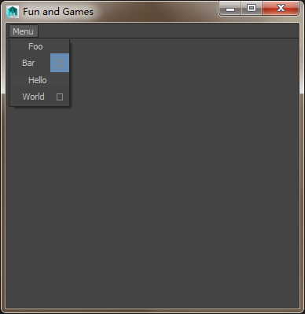

# 3.1.QAction
类似maya里的下拉菜单


```python
import os
import sys

from PyQt4 import QtGui, QtCore

MY_ICON = [
        '16 16 4 1',
        '  c None',
        '. c #c6c4c4',
        'l c #888888',
        ': c #909090',
        '                ',
        '                ',
        '                ',
        '                ',
        '    llllllll    ',
        '    l      l    ',
        '    l      l    ',
        '    l      l    ',
        '    l      l    ',
        '    l      l    ',
        '    l      l    ',
        '    l      l    ',
        '    llllllll    ',
        '                ',
        '                ',
        '                ',
        '                ',
        '                ',
]

## Custom Action used to provide an action and a clickable icon
#
class ExtendedQAction(QtGui.QWidgetAction):
        def __init__(self, label, mainAction, secondaryAction, *args, **kw):
                QtGui.QWidgetAction.__init__(self, *args, **kw)

                myWidget = QtGui.QWidget()
                myLayout = QtGui.QHBoxLayout()
                myLayout.setSpacing( 0 )
                myLayout.setContentsMargins( 0, 0, 0, 0 )
                myWidget.setLayout(myLayout)
                myLabel = ExtendedQLabel(label)
                myIcon = ExtendedQLabel()
                myIcon.setPixmap(QtGui.QPixmap(MY_ICON))
                myLayout.addWidget(myLabel, stretch=1)
                myLayout.addWidget(myIcon, stretch=0)

                ## Hack in the hover colors to a style sheet
                #  The global stylesheet is not controlling the highlight color.
                #  It would be good to figure out how to avoid hardcoding styles here.
                defaultHLBackground = "#%02x%02x%02x" % myWidget.palette().highlight().color().getRgb()[:3]
                defaultHLText = "#%02x%02x%02x" % myWidget.palette().highlightedText().color().getRgb()[:3]
                myLabel.setStyleSheet('padding-left:14px')
                myWidget.setStyleSheet("QWidget:hover { background:%s; color: %s;} QWidget { padding: 4px; margin:0px}" % (defaultHLBackground,defaultHLText))


                myIcon.setToolTip("Secondary Action Toolttip" )

                self.connect(myLabel, QtCore.SIGNAL('clicked()'), mainAction)
                self.connect(myIcon, QtCore.SIGNAL('clicked()'), secondaryAction)

                self.setDefaultWidget(myWidget)


## Clickable QLabel, this was the path of least resistance for making a
#  clickable image/label.
#
class ExtendedQLabel(QtGui.QLabel):

        def __init(self, parent):
                QtGui.QLabel.__init__(self, parent)

        def mouseReleaseEvent(self, ev):
                self.emit(QtCore.SIGNAL('clicked()'))


################################################################################
# Usage of the dual action menu items.
################################################################################
class MyMainWindow(QtGui.QMainWindow):
        def __init__(self, *args, **kwargs):
                QtGui.QMainWindow.__init__(self, *args, **kwargs)

                regularAction = QtGui.QAction('Foo', self)
                extendedAction = ExtendedQAction('Bar', self.mainAction, self.secondaryAction, self)
                regularAction2 = QtGui.QAction('Hello', self)
                extendedAction2 = ExtendedQAction('World', self.mainAction, self.secondaryAction, self)

                menubar = self.menuBar()
                myMenu = menubar.addMenu('&Menu')
                myMenu.addAction(regularAction)
                myMenu.addAction(extendedAction)
                myMenu.addAction(regularAction2)
                myMenu.addAction(extendedAction2)

                self.setWindowTitle('Fun and Games')

        def mainAction(self):
                print "performing main action"

        def secondaryAction(self):
                print "performing sectiondary action"

def main():
        app = QtGui.QApplication(sys.argv)
        funAndGames = MyMainWindow()
        funAndGames.show()
        sys.exit(app.exec_())

if __name__ == '__main__':
        main()
```

