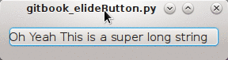

# 带overflow效果的按钮
想实现的效果是，当QPushButton上的label过长的时候，自动把过长的部分...类似css里的overflow效果



代码如下：
```python
#!/usr/bin/env python2
import os
import sys
from PyQt4 import QtGui, QtCore
from PyQt4.QtCore import Qt, QString


class ElideButton(QtGui.QPushButton):

    def __init__(self, parent=None):

        super(ElideButton, self).__init__(parent)
        font = self.font()
        font.setPointSize(10)
        self.setFont(font)

    def paintEvent(self, event):
        painter = QtGui.QStylePainter(self)

        metrics = QtGui.QFontMetrics(self.font())
        elided = metrics.elidedText(self.text(), Qt.ElideRight, self.width())

        option = QtGui.QStyleOptionButton()
        self.initStyleOption(option)
        option.text = ''
        painter.drawControl(QtGui.QStyle.CE_PushButton, option)
        painter.drawText(self.rect(), Qt.AlignLeft | Qt.AlignVCenter, elided)


class TheUI(QtGui.QDialog):

    def __init__(self, args=None, parent=None):
        super(TheUI, self).__init__(parent)
        self.layout = QtGui.QVBoxLayout(self)
        self.button = ElideButton('Oh Yeah This is a super long string')
        self.layout.addWidget(self.button)
        self.setMinimumWidth(20)

if __name__ == '__main__':
    app = QtGui.QApplication(sys.argv)
    gui = TheUI()
    gui.show()
    app.exec_()
```
其实这个例子有个小缺陷，label左侧应该有些空隙（由style决定的）但是此处没有继承到。
